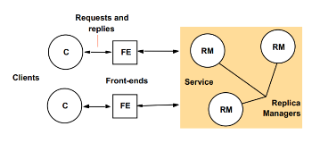

# Relatório do projeto *Bicloin*

Sistemas Distribuídos 2020-2021, segundo semestre

## Autores

**Grupo A60**

| Nome              | Utilizador                                     |
|-------------------|------------------------------------------------|
|Ana Sofia Moreira | <https://git.rnl.tecnico.ulisboa.pt/ist173783> |
|Mariana Medeiros  | <https://git.rnl.tecnico.ulisboa.pt/ist189503> |
|                   |                                                |

  

## Melhorias da primeira parte
- [Correção de bug ao correr a app, no comando bike-up, se se fizesse bike-up de uma estação muito longe, a variável hasBike do user ficaria verdadeira erroneamente (pois o utilizador não chegou a levantar a bicicleta devido ao erro "ERRO fora de alcance", o que fazia com que, ao correr de seguida bike-up <estacao proxima> em vez de operação ser bem sucedida e receber "OK", recebia o erro "ERRO utilizador ja se encontra com uma bicicleta"](https://git.rnl.tecnico.ulisboa.pt/SD-20-21-2/A60-Bicloin/commit/6f5c369a3335a567189f8da0eab5093ce75be63c)
- [Correção de bug ao correr a app, no comando bike-up, que mesmo que o utilizador estivesse demasiado longe da estação que pretendia fazer bike-up, era debitado do seu saldo (balance) as 10 BiCloins do custo de levantar uma bicicleta, mesmo que o utilizador não a tivesse levantado devido ao erro "ERRO fora de alcance"](https://git.rnl.tecnico.ulisboa.pt/SD-20-21-2/A60-Bicloin/commit/6f5c369a3335a567189f8da0eab5093ce75be63c) 
- [Adicionou-se a exceção TooFarException a ser lançada quando o utilizador tentasse levantar uma bicicleta (com o comando bike-up) de uma estação longe de si; antes não havia exceção, mas apenas uma string com a mensagem de erro pretendida "ERRO fora de alcance"](https://git.rnl.tecnico.ulisboa.pt/SD-20-21-2/A60-Bicloin/commit/6f5c369a3335a567189f8da0eab5093ce75be63c)
- [Correção de bug no teste infoStationSuccess do hub-tester, em que se comparava um valor float com um valor com vírgula em vez de ponto](https://git.rnl.tecnico.ulisboa.pt/SD-20-21-2/A60-Bicloin/commit/cbaa57386af17633e16677ab1fa200c9356a4a9f) 
- [Adicionou-se o método exit à app](https://git.rnl.tecnico.ulisboa.pt/SD-20-21-2/A60-Bicloin/commit/7c72f9bff6bd6a50e2063975604bad702d7d5923)  
- [Correção de comando bike-down no demo, faltava o nome da estação](https://git.rnl.tecnico.ulisboa.pt/SD-20-21-2/A60-Bicloin/commit/7fe1973f5b4d2ec9556a1c438fceed41fe8c4884)
- [Correção dos comandos de compilação do rec e da app, na demo](https://git.rnl.tecnico.ulisboa.pt/SD-20-21-2/A60-Bicloin/commit/48a2caef4e30f1470b2eaa8bddad96768f470db1)
- [Correção de coordenadas erradas em resultado de comando at, na demo](https://git.rnl.tecnico.ulisboa.pt/SD-20-21-2/A60-Bicloin/commit/48a2caef4e30f1470b2eaa8bddad96768f470db1)
- [Adicionou-se ao demo o comando mov loc2 que faltava, necessário para os comandos bike-up](https://git.rnl.tecnico.ulisboa.pt/SD-20-21-2/A60-Bicloin/commit/48a2caef4e30f1470b2eaa8bddad96768f470db1)

## Modelo de faltas
Usando o protocolo de replicação Protocolo Registo Coerente (versão básica), as faltas que pretendemos que fossem toleradas na implementação da segunda parte do projeto são: as faltas silenciosas: como um fail-stop detetável ou um crash, situações em que o canal pode não ter entregue uma mensagem, situações em que o componente pare e deixe de responder.  
As mensagens enviadas são recebidas desde que a origem e o destino não falhem. Caso um servidor falhe, uma das suas réplica garante que a resposta é devolvida ao cliente uma vez que as réplicas são iguais e funcionam em paralelo. Para garantir a coerência, idealmente um cliente ao ler de uma das réplicas deve sempre ler o valor mais atual (de maior tag, maxTag referida abaixo no Protocolo de Replicação).  
Sendo mais difíceis de detetar, não foram consideradas as faltas bizantinas (ou arbitrárias), em que o processo responde de maneira errada, responde mesmo quando não é estimulado, ou simplesmente não responde aos seus estímulos, situações em que a mensagem chega com conteúdo corrompido ou não é entregue.

## Solução
  
Tratando-se de falhas silenciosas em sistemas assíncronos, esperar-se-ia que f+1 réplicas tolerassem f nós em falha pelo que basta que uma réplica correcta responda para termos o valor correcto.  Assim mesmo que uma réplica do rec falhe, se houver outra réplica a correr em paralelo que a correr em paralelo, o sistema se mantenha disponível tolerando assim por exemplo, falhas em que o servidor deixe de responder ou pare devido às razões explicadas acima no Modelo de faltas.  
As réplicas são todas idênticas e executam em paralelo o serviço de forma a que quando um cliente envie um pedido às réplicas (e cada réplicas executa o pedido e envia a sua resposta), uma resposta seja retornada de entre o conjunto de respostas de todas as réplicas. Assim, se uma réplica falhar não há problema pois há outras respostas prontas a serem disponibilizadas ao cliente.   
Sendo assim, a existência de mais réplicas do hub (para além da existência de réplicas do rec), são importantes para a continuação do funcionamento do programa caso o servidor deixe de funcionar ou deixe de responder.

## Protocolo de replicação
O protocolo que escolhemos para a implementação das réplicas foi o Protocolo Registo Coerente – versão básica. Este permite que quando um cliente lê um registo, não está a decorrer nenhuma escrita concorrente no registo (não havendo conflitos de alteração de conteúdo) e o valor devolvido é o valor mais recente.  
Este protocolo tem um sistema de quoruns, no nosso caso QuorumFrontend no rec-tester. Tendo como objetivo distribuir registos com coerência forte, em que o grau de replicação é N = 2f + 1.  
Para cada réplica (do rec), guardar-se-ia para cada registo uma tag que identifica a versão dessa réplica.  Quando o cliente faz uma operação de read() para todas as réplicas, aguarda resposta de um quorum e recebe o maxVal que é o valor associado à maior tag; enquanto que a réplica ao receber o pedido de read(), responde com esse maxVal.  
Quando o cliente faz uma operação de write() para todas as réplicas, antes tem de obter a maxtag para poder escrever nessa tag incrementada (tag + 1), faz isto com uma leitura, read (pois uma escrita implica sempre uma fase de leitura para determinar o valor de maxTag) de seguida envia o pedido de escrita (write) com essa nova tag, aguarda resposta de um dos quoruns que a operação foi bem sucedida (ack); enquanto que a réplica ao receber o pedido de write, escreve o valor na tag pretendida.

## Medições de desempenho
Implementou-se a solução de base das chamadas remotas ao Rec com protocolo de registo coerente, ou seja com os stubs não bloqueantes e com o paralelismo, não atentando ainda a preocupações de desempenho. Num sistema assíncrono, como o tratado no projeto, a comunicação e processamento podem demorar um tempo arbitrário, de maneira a que não se podem impôr limites temporais como num sistema síncrono.
O tempo é uma métrica que é usada para a medição o desempenho em sistemas assíncronos uma vez que estes, ao contrário dos sistemas síncronos, não garantem os limites temporais que os sistemas síncronos admitem, sendo estes limites temporais: cada mensagem chegar ao destino dentro de um tempo limite conhecido; o tempo de execução de cada passo de um processo estar entre limites mínimo e máximo conhecidos; a taxa em que cada relógio local se desvia do tempo absoluto ter um limite conhecido.  
As métricas para a tolerância de faltas permitem quantificar o quão tolerante a faltas é esse sistema e ao mesmo tempo comparar sistemas diferentes. De maneira a otimizar o desempenho, usar-se-ia como métrica de análise ao desempenho o tempo de resposta aos pedidos (desde o momento em que se faz a chamada até ao momento que é recebida) e o número de pedidos read e o número de pedidos write.
_(Tabela-resumo)_

## Opções de implementação
Otimizações e melhorias possíveis incluiriam: garantir que o CPU não está demsasiado lento, trabalhando concorrentemente com RPCs a começarem a trabalhar sem terem de esperar por resposta da conclusão dos procedimentos remotos mais antigos, não bloqueando a thread (wait) à espera que o trabalho fosse concluído. Deve-se ter também cuidado ao otimizar o código de maneira a que a complexidade deste não aumente demasiado.

## Notas finais
_(Algo mais a dizer?)_